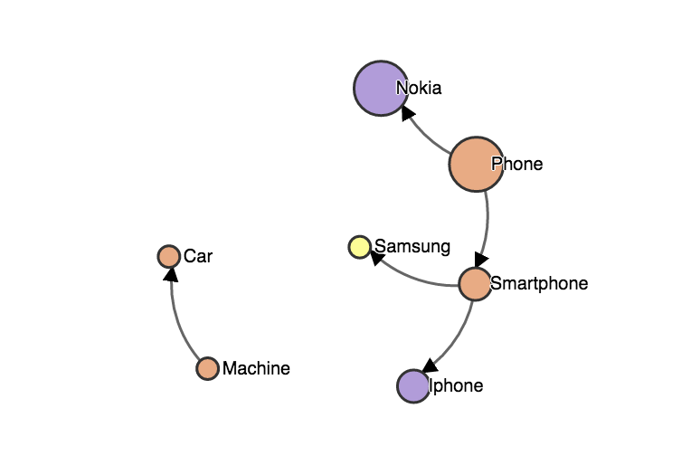

Code review tool

This is example usage of scalameta. I wanted to build some nice UI with some statistics about objects. 
UI is build with d3js from this example:
http://bl.ocks.org/mbostock/1153292

For example: 

- I want to see dependencies between types in my project 
- I want to see number of statements in specific type of object 
- I want to see type of object etc.

For sake of simplicity I’m interested in 3 scala object types: class, object, trait.

Look at Main.scala:

```scala
object Main extends App{
  val metricsData = MetricsService.getMetrics("src/main/scala/TestInheritance.scala")

  MetricsService.saveToFile(metricsData)
}
```
metricsData is object which contains object statistics and also dependencies between objects. Next we save it as Json to file.

We build metrics data only for one file: TestInheritance.scala:


```scala
trait Machine
trait Car extends Machine

trait Phone{
  def makeCall = "calling"
  def writeMsg = "msg"
  def charge   = "charge"

}
case class Nokia() extends Phone{
  val contacts = List()
  val dateOfProduction = 2005
  def takePhoto = "photo"
}

trait Smartphone extends Phone {
  def openBrowser = "opening"
}
case class Iphone() extends Smartphone {
  def removeJack = {
    "removing"
  }
}
object Samsung extends Smartphone
```

If you want build similar metrics for whole directories I've
included in utils methods which will traverse each file in specified directory so modify this for your purposes.

If you want to modify your class structure you need to update json with data. To do this run:

```
sbt run
```

Open metrics.html to see results. Double click on the circle to see modal with object simple statistics.

